<div align="center">

<!-- Wave Animation Header with Name -->


<br/>

<!-- Animated Typing Text -->
<a href="https://git.io/typing-svg">
  
</a>

<br/>

<!-- Animated Social Badges with Glow Effect -->
<p>
  <a href="https://www.linkedin.com/in/krishna-jadhav-a5122a316/" target="_blank">
    
  </a>
  <a href="mailto:jadhavkrishna475@gmail.com">
    
  </a>
  <a href="https://github.com/KrishnaJadhav2525" target="_blank">
    
  </a>
  <a href="https://twitter.com/" target="_blank">
    
  </a>
</p>

<!-- Animated Profile Views Counter -->


</div>

<br/>

## 🎯 About Me

```python
class KrishnaJadhav:
    """
    🌟 Passionate Full Stack Developer & AI Enthusiast from India 🇮🇳
    🚀 Bridging Web Development with Data Analytics & Machine Learning
    💡 Turning complex data into insights and elegant solutions
    """    
    def __init__(self):
        self.username = "KrishnaJadhav2525"
        self.location = "Nashik, Maharashtra, India 📍"
        self.education = "Computer Science Graduate 🎓"
        self.stack = ["Full Stack Web", "Data Analytics", "Python/AI", "Machine Learning"]
        self.passion = ["Building Intelligent Systems 🤖", "Data Science 📊", "Clean Code ✨"]
        self.hobbies = ["Coding 💻", "Learning New Tech 📚", "Problem Solving 🧩"]
        
    @property
    def current_status(self):
        return {
            "🔭 Work": "Building AI-powered web applications",
            "🌱 Learning": ["Deep Learning", "Advanced Data Analytics", "LLMs"],
            "👯 Looking For": "Data Science & AI Engineering roles",
            "💬 Ask Me About": "React, Python, Data Science, Machine Learning",
            "⚡ Fun Fact": "I debug with coffee and solve problems with code!"
        }
        
    def my_journey(self):
        return """
        ✨ Started with curiosity → Building robust systems
        🎯 Clean code advocate → User-centric products
        🚀 Always learning → Always growing
        """
        
    def get_skills(self):
        return {
            "languages": ["Python", "JavaScript", "TypeScript", "Java", "SQL"],
            "frameworks": ["React", "Next.js", "Node.js", "Express", "TailwindCSS"],
            "databases": ["MongoDB", "PostgreSQL", "MySQL", "Firebase"],
            "tools": ["Git", "Docker", "VS Code", "Postman", "Figma"],
            "ai_ml": ["TensorFlow", "Scikit-learn", "Pandas", "NumPy", "Matplotlib"]
        }
```

<div align="center">

<!-- Animated Divider -->


</div>

---

## 🛠️ Tech Stack

<div align="center">

### 🖥️ Frontend Development
<p>
  
</p>

### ⚙️ Backend Development
<p>
  
</p>

### 🗄️ Databases & Cloud
<p>
  
</p>

### 🤖 AI/ML & Data Science
<p>
  
  
  
  
  
</p>

### 🛠️ Tools & DevOps
<p>
  
</p>

</div>

<div align="center">

<!-- Animated Divider -->


</div>

---

## 📊 GitHub Statistics

<div align="center">
  
  
</div>

<div align="center">
  
  
</div>

<br/>

<!-- Detailed Stats Card -->
<div align="center">
  
</div>

<br/>

<!-- Contribution Graph -->
<div align="center">
  
</div>

<div align="center">

<!-- Animated Divider -->


</div>

---

## 💭 Random Dev Quote

<div align="center">


</div>

---

## 🎯 Current Focus

```mermaid
graph LR
    A[🎯 Current Goals] --> B[Deep Learning]
    A --> C[System Design]
    A --> D[Open Source]
    B --> E[Neural Networks]
    B --> F[LLMs]
    C --> G[Scalable Apps]
    C --> H[Microservices]
    D --> I[Contributing]
    D --> J[Building]
    
    style A fill:#6366F1,stroke:#4F46E5,stroke-width:3px,color:#fff
    style B fill:#8B5CF6,stroke:#7C3AED,stroke-width:2px,color:#fff
    style C fill:#8B5CF6,stroke:#7C3AED,stroke-width:2px,color:#fff
    style D fill:#8B5CF6,stroke:#7C3AED,stroke-width:2px,color:#fff
```

<div align="center">



</div>

<div align="center">

<!-- Animated Divider -->


</div>

---

## 📬 Let's Connect & Collaborate

<div align="center">

<p>
  <i>💡 I'm always open to discussing new projects, creative ideas, or opportunities to be part of your vision!</i>
  <br/>
  <i>☕ Let's grab a virtual coffee and chat about tech, AI, or your next big idea!</i>
</p>

<br/>

<a href="https://www.linkedin.com/in/krishna-jadhav-a5122a316/" target="_blank">
  
</a>
<a href="mailto:jadhavkrishna475@gmail.com">
  
</a>

<br/><br/>

### 🌐 Find Me Around the Web

<p>
  <a href="https://github.com/KrishnaJadhav2525" target="_blank">
    
  </a>
  <a href="https://www.linkedin.com/in/krishna-jadhav-a5122a316/" target="_blank">
    
  </a>
  <a href="https://twitter.com/" target="_blank">
    
  </a>
  <a href="https://dev.to/" target="_blank">
    
  </a>
  <a href="https://stackoverflow.com/" target="_blank">
    
  </a>
</p>

</div>

<div align="center">

<!-- Animated Divider -->


</div>

---

<div align="center">

### 🤝 Open to Opportunities

<p>
  <i>Interested in collaborating on innovative projects or discussing opportunities in Full Stack Development, AI, and Data Engineering.</i>
  <br/>
  <i>Feel free to reach out through LinkedIn or email.</i>
</p>

</div>

<br/>

<div align="center">

<p>
  
  
  
</p>

<p align="center">
  <i>⭐️ From <a href="https://github.com/KrishnaJadhav2525">KrishnaJadhav2525</a> with 💜</i>
</p>

</div>